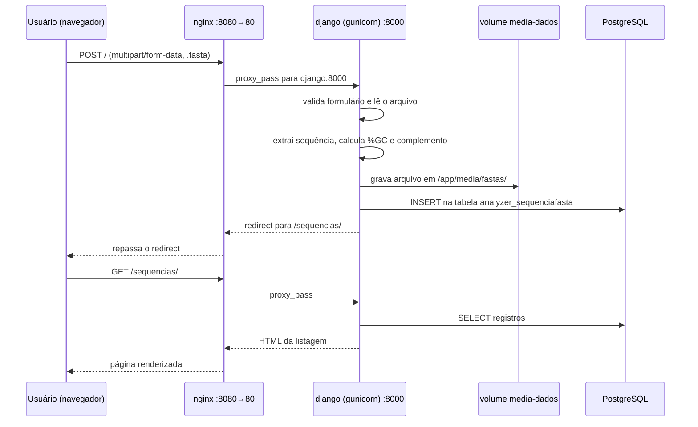

# Defesa técnica — fasta-analyzer

Aplicação Django para upload e análise de arquivos FASTA, orquestrada em
três containers: Nginx (proxy reverso), Django com Gunicorn (aplicação) e
PostgreSQL (banco de dados), com persistência em volumes Docker.

---

## 1. Visão geral da arquitetura

Fluxo: **Cliente → Nginx → Django/Gunicorn → PostgreSQL**, com três
containers de responsabilidade única, comunicando-se por uma rede Docker
privada, e três volumes nomeados garantindo persistência.

-1.png>)

**Diagrama de implantação (Deployment Diagram):** os retângulos `nginx`,
`django` e `db` são *nodes* — processos em execução em cada container. Os
cilindros (`media-dados`, `static-dados`, `postgres-dados`) são artefatos
de armazenamento persistente (volumes). O contêiner tracejado delimita a
rede Docker interna.

**Responsabilidade de cada componente** ("um processo por container"):

- **nginx** — recebe o tráfego HTTP e distribui.
- **django** — executa a lógica de negócio.
- **db** — armazena os dados.

Essa separação permite escalar, atualizar ou substituir cada peça
independentemente, refletindo o modelo usado por orquestradores como
Kubernetes.

---

## 2. Imagem Docker da aplicação Django

```dockerfile
FROM python:3.12-slim

ENV PYTHONDONTWRITEBYTECODE=1
ENV PYTHONUNBUFFERED=1

WORKDIR /app

RUN apt-get update && apt-get install -y --no-install-recommends \
    build-essential \
    libpq-dev \
    && rm -rf /var/lib/apt/lists/*

COPY requirements.txt .
RUN pip install --no-cache-dir -r requirements.txt

COPY . .

RUN mkdir -p /app/media /app/staticfiles

EXPOSE 8000

CMD ["gunicorn", "config.wsgi:application", "--bind", "0.0.0.0:8000"]
```

**Imagem base — `python:3.12-slim`:** variante enxuta, sem pacotes de
sistema desnecessários, resultando numa imagem menor que a `python:3.12`
padrão, sem perder compatibilidade.

**`PYTHONDONTWRITEBYTECODE=1` / `PYTHONUNBUFFERED=1`:** evitam arquivos
`.pyc` desnecessários e garantem que logs apareçam imediatamente em
`docker logs`, sem ficar em buffer.

**`WORKDIR /app`:** define o diretório de trabalho — `COPY`, `RUN` e `CMD`
passam a operar relativos a ele.

**Dependências de sistema (`build-essential`, `libpq-dev`):** o driver
`psycopg2-binary`, usado para conectar ao PostgreSQL, depende da
biblioteca cliente do Postgres (`libpq`) e, em algumas arquiteturas, de um
compilador C. Sem essas duas dependências, sua instalação falharia.

**Ordem do `COPY` (cache de camadas):** `requirements.txt` é copiado e
instalado **antes** do restante do código (`COPY . .`). Como as
dependências mudam bem menos que o código, essa ordem evita reinstalar
todos os pacotes a cada alteração — só a camada a partir do `COPY . .`
precisa ser refeita.

**`RUN mkdir -p /app/media /app/staticfiles`:** cria os diretórios de
upload e estáticos antes de qualquer volume ser montado sobre eles.

**`EXPOSE 8000`:** documenta a porta interna — não publica nada
automaticamente; isso é feito na orquestração (seção 3).

**Sem `VOLUME` no Dockerfile:** os volumes são declarados no
`docker-compose.yml`, não aqui — porque o volume de mídia é
**compartilhado** entre `django` e `nginx`, relação que só existe no nível
da orquestração.

**`CMD` e uso do Gunicorn:**

```dockerfile
CMD ["gunicorn", "config.wsgi:application", "--bind", "0.0.0.0:8000"]
```

Gunicorn é um servidor WSGI de produção, substituindo o `manage.py
runserver` (thread única, sem otimizações, expõe detalhes de depuração).
`config.wsgi:application` aponta para o ponto de entrada gerado pelo
Django. `--bind 0.0.0.0:8000` escuta em todas as interfaces — obrigatório
em containers, já que `127.0.0.1` só aceitaria conexões originadas do
próprio container, e o Nginx (em outro container) não conseguiria
alcançá-lo.

---

## 3. Orquestração com Docker Compose

```yaml
services:
  db:
    image: postgres:16-alpine
    environment:
      POSTGRES_DB: ${POSTGRES_DB}
      POSTGRES_USER: ${POSTGRES_USER}
      POSTGRES_PASSWORD: ${POSTGRES_PASSWORD}
    volumes:
      - postgres-dados:/var/lib/postgresql/data
    healthcheck:
      test: ["CMD-SHELL", "pg_isready -U ${POSTGRES_USER} -d ${POSTGRES_DB}"]
      interval: 5s
      timeout: 5s
      retries: 5

  django:
    build: .
    command: gunicorn config.wsgi:application --bind 0.0.0.0:8000
    environment:
      DB_ENGINE: postgres
      POSTGRES_HOST: db
      POSTGRES_PORT: 5432
      MEDIA_ROOT: /app/media
    volumes:
      - media-dados:/app/media
      - static-dados:/app/staticfiles
    depends_on:
      db:
        condition: service_healthy

  nginx:
    build: ./nginx
    ports:
      - "8080:80"
    volumes:
      - media-dados:/app/media
      - static-dados:/app/staticfiles
    depends_on:
      - django

volumes:
  postgres-dados:
  media-dados:
  static-dados:
```

| Serviço | Imagem | Portas | Volumes | Dependências |
|---|---|---|---|---|
| `db` | `postgres:16-alpine`, oficial | Nenhuma publicada — só interna, `5432` | `postgres-dados` → dados internos do banco | Nenhuma; possui `healthcheck` (`pg_isready`) usado pelo `django` |
| `django` | Build próprio (`Dockerfile` na raiz) | Nenhuma publicada — só interna, `8000` | `media-dados` (uploads) e `static-dados` (estáticos) | `db` saudável (`service_healthy`) |
| `nginx` | Build próprio (`nginx/Dockerfile`, base `nginx:1.27-alpine`) | `8080:80` — único ponto de entrada externo | `media-dados` e `static-dados`, os **mesmos** do `django` | `django` iniciado |

**Por que o Postgres não tem Dockerfile próprio:** não há código
específico do projeto para embutir nele — toda a configuração (nome do
banco, usuário, senha) é feita via variáveis de ambiente, já suportadas
nativamente pela imagem oficial.

**Variáveis de ambiente do `django`:** além das de conexão com o banco,
`DEBUG` e `SECRET_KEY` controlam segurança da aplicação, e `MEDIA_ROOT`
define onde os uploads são salvos.

**Volumes declarados no nível raiz:** ao declará-los uma única vez fora
de um serviço específico, eles podem ser **compartilhados** entre
containers — é isso que permite ao Nginx servir arquivos gravados pelo
Django.

---

## 4. Comunicação entre os containers

No `docker-compose.yml`, o Django se conecta ao banco com
`POSTGRES_HOST=db`; no `nginx.conf`, o Nginx aponta para `server
django:8000`. Nem `db` nem `django` são IPs — são **nomes de serviço**.

**Como se localizam:** ao rodar `docker compose up`, o Compose cria uma
rede privada e registra cada serviço nela com **DNS interno**, baseado no
nome do serviço no YAML. Dentro dessa rede, `db` resolve automaticamente
para o IP do container do Postgres, sem fixar IP manualmente (que
mudaria a cada recriação).

**Por que não `localhost`:** de dentro de um container, `localhost` se
refere **só a ele mesmo** — cada container tem seu próprio "localhost"
isolado. É preciso usar o nome do serviço (`db`), resolvido pelo DNS
interno do Compose.

**Portas internas vs. externas:** `django` e `db` não publicam porta
nenhuma para o host — só `nginx` publica (`8080:80`). Isso é uma camada
de segurança: mesmo conhecendo a porta interna do Django ou do Postgres,
não há como alcançá-los de fora do ambiente Docker.

---

## 5. Nginx e proxy reverso

```nginx
upstream django {
    server django:8000;
}

server {
    listen 80;
    client_max_body_size 20M;

    location /static/ { alias /app/staticfiles/; }
    location /media/  { alias /app/media/; }

    location / {
        proxy_pass http://django;
        proxy_set_header Host $host;
        proxy_set_header X-Real-IP $remote_addr;
        proxy_set_header X-Forwarded-For $proxy_add_x_forwarded_for;
        proxy_set_header X-Forwarded-Proto $scheme;
    }
}
```

**Papel:** único ponto de entrada externo da aplicação. Recebe o tráfego
na porta pública e decide, pelo caminho da URL, se responde diretamente
(estáticos/mídia) ou repassa ao Django.

**Como recebe:** `listen 80` dentro do container, mapeado no compose para
a porta `8080` do host — por isso o acesso é em `localhost:8080`.

**Como encaminha (proxy reverso):** `upstream django { server
django:8000; }` define o destino; `proxy_pass http://django;`, dentro de
`location /`, executa o repasse de tudo que não for `/static/` ou
`/media/`. Os `proxy_set_header` preservam IP real, host e protocolo
originais — informações que o Django usa para funcionar corretamente
atrás de um proxy, inclusive na validação de CSRF.

**Estáticos e mídia direto do disco:** os blocos `location /static/` e
`/media/` respondem via `alias`, sem acionar o Django — muito mais rápido.
Só funciona porque o Nginx monta os mesmos volumes (`media-dados`,
`static-dados`) usados pelo Django para gravar esses arquivos.

**`client_max_body_size 20M`:** eleva o limite padrão de 1MB do Nginx,
necessário para aceitar uploads de `.fasta` maiores.

**Portas envolvidas:** `8080` (host, pública) → `80` (`nginx`) → `8000`
(`django`).

---

## 6. Persistência de dados

Todo container tem uma **camada de escrita** própria, criada ao iniciar e
**destruída por completo** ao ser removido. Um **volume nomeado** é uma
área gerenciada separadamente pelo Docker Engine, que existe
independente do ciclo de vida de qualquer container — o que é gravado
nele sobrevive à remoção do container que o usava.

**PostgreSQL** — volume `postgres-dados`, montado em
`/var/lib/postgresql/data`. Se o container `db` for removido e recriado,
o novo container, montando o mesmo volume, encontra o banco intacto —
sem precisar rodar `migrate` de novo.

**Uploads** — volume `media-dados`, montado em `/app/media` tanto no
`django` (grava) quanto no `nginx` (serve). Se `django`/`nginx` forem
removidos e recriados, os arquivos `.fasta` continuam lá, acessíveis
imediatamente pelo novo container.

**Contraexemplo, testado na prática:** sem declarar o volume, o diretório
`/app/media/fastas/` (criado dinamicamente no primeiro upload) deixa de
existir após remover e recriar o container — porque vivia só na camada de
escrita efêmera, descartada junto com ele.

---

## 7. Fluxo do upload de um arquivo



1. Usuário envia o formulário (`multipart/form-data`, obrigatório para
   arquivos binários).
2. **Nginx** recebe na porta `8080`/`80` e repassa ao **Django**, na
   porta `8000`.
3. A view valida o formulário, cria a instância do model **sem salvar**
   (`commit=False`) e lê o conteúdo do arquivo em memória.
4. `bio_utils.py` extrai a sequência e calcula %GC e complemento reverso.
5. Só então `instancia.save()` é chamado: o Django grava o arquivo em
   `MEDIA_ROOT/fastas/` — caminho do volume **compartilhado**
   `media-dados` — e insere o registro no **PostgreSQL**.
6. Django responde com redirect para `/sequencias/`, que passa de novo
   pelo Nginx.
7. Ao carregar a listagem, o mesmo caminho se repete: Nginx → Django →
   Postgres → HTML renderizado com a nova sequência.

A partir do passo 5, o arquivo está no volume e sobrevive
independentemente do que acontecer com os containers `django` ou
`nginx`.

---

## 8. Análise técnica da solução

**Vantagens**

1. Responsabilidade única por container — falha num serviço não derruba
   os demais.
2. Persistência garantida por volumes nomeados, comprovada na prática
   (cenário normal e contraexemplo sem volume).
3. Superfície de ataque reduzida — só o Nginx expõe porta pública.

**Limitações atuais**

1. Sem HTTPS/TLS — comunicação em HTTP puro.
2. Segredos em texto plano no `.env`, sem gerenciador dedicado.
3. Sem escalonamento horizontal — um único worker/réplica por serviço.

**Melhorias para produção**

1. TLS no Nginx (ex.: Let's Encrypt/Certbot) com redirecionamento
   automático HTTP → HTTPS.
2. Gerenciador de segredos dedicado e usuários não-root explícitos
   (`USER` no Dockerfile).
3. Backup automatizado do volume `postgres-dados` e réplicas do `django`
   atrás do Nginx para tolerância a falhas.
