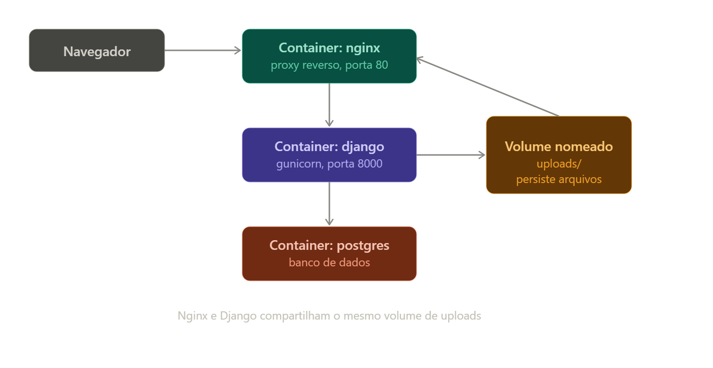

Analisador de arquivos FASTA — usuário faz upload de um .fasta, o Django processa, calcula %GC e complemento reverso de cada sequência do arquivo, salva os resultados no PostgreSQL, e mantém o arquivo original guardado num volume persistente.

Arquitetura final:
